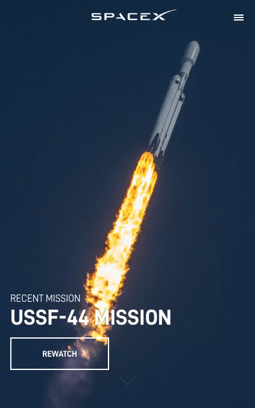
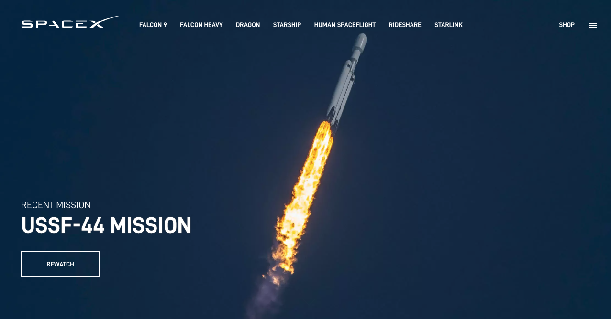
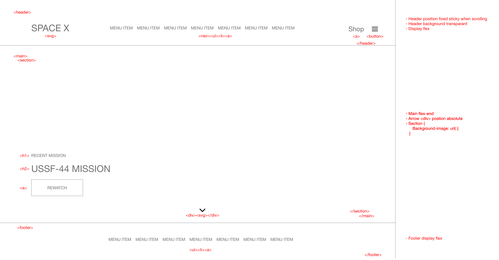
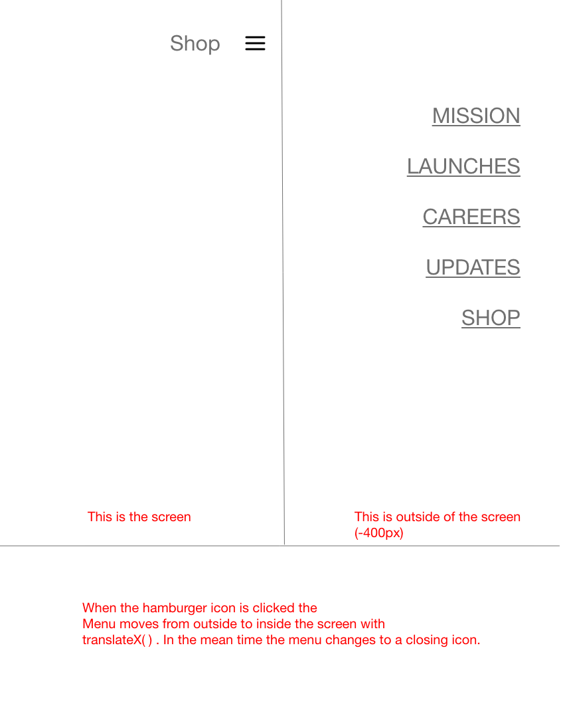
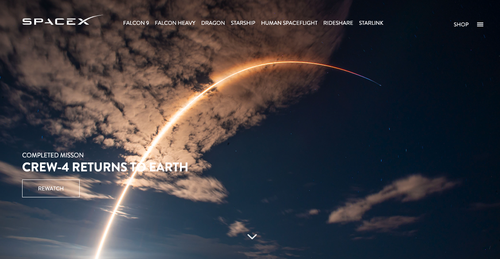
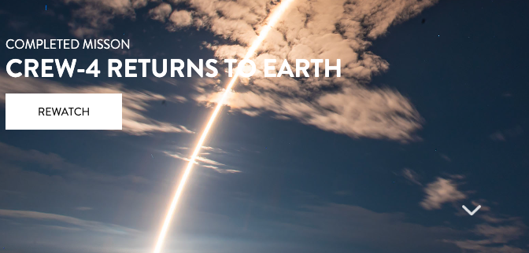

# SpaceX_EmileKost

## Jij

  
uitwerken voor kick-off werkgroep

  ### Auteur:
  Emile Kost

  #### Je startniveau:
  Rood/Zwart

  #### Je focus:
  Ik heb gekozen voor beide.
 

<!-- Nog maken -->
## Je website

  
uitwerken voor kick-off werkgroep

  ### Je opdracht:
  Ik heb gekozen voor de website van SpaceX.

  #### Screenshot(s) van de eerste pagina (small screen): 
  Link naar SpaceX: https://www.spacex.com/
  

  #### Screenshot(s) van de tweede pagina (small screen):
  hier de naam van de pagina  
  
 

## Toegankelijkheidstest 1/2 (week 1)

  
uitwerken na test in 1e werkgroep

  ### Bevindingen
 Bevindingen SpaceX website:
  - Hamburger menu icoon is met screen reader niet bruikbaar
  - Contrast is soms best slecht
  - Mensen met een screenreader kunnen de items in het hamburgermenu
    niet bereiken.

  #### Screenreader
 De screeen reader kan bijna elk element bereiken. Deze kan echter niet bij het hamburger menu icoon komen. Tevens kan de gebruiker niet bij de items van dit menu komen waardoor ze niet alle pagina's
 kunnen bezoeken.

  Dit kan opgeslot worden door van het hamburger icoon een semantische button te maken.

  #### Muis en Toetsenbord 
  Bij het testen van het muis en toetsenbord was eigenlijk geen enkel probleem. De buttons en linkjes zijn groot genoeg en beschikken allemaal over de juiste states.

  Hier is geen oplossing voor nodig.

  #### Motoriek (shocks, elastiekjes)
  De website is redelijk goed te gebruiken voor mensen met een slechte moteriek. Dit komt omdat de buttons groot genoeg zijn om te bedienen. Dit geldt ook voor de linkjes.

  #### Visueel (brillen, contrast, kleurenblind, dark/light). 
  Bij sommige achtergrond foto's is het contrast met de witte tekst erg slecht. Hierdoor is de tekst heel erg moeilijk leesbaar. 

  Een oplossing hiervoor is om alleen foto's van SpaceX te laten zien die een donkere achtergrond beschikken waardoor het contrast goed blijft. 

## Breakdownschets (week 1)

  
uitwerken na afloop 2e werkgroep

  ### de hele pagina: 
  

  ### dynamisch deel (bijv menu): 
  

## Voortgang 1 (week 2)

  
uitwerken voor 1e voortgang

  ### Stand van zaken
  Deze week ging erg goed en was ik begonnen met zowel de HTML als CSS

  ### Agenda voor meeting
  samen met je groepje opstellen

  | student 1      | student 2          | student 3    | student 4        |
  | ---            | ---                | ---          | ---              |
  | dit bespreken  | en dit             | en ik dit    | en dan ik dat    |
  | en dat ook nog | dit als er tijd is | nog een punt | dit wil ik zeker |
  | ...            | ...                | ...          | ...              |

  ### Verslag van meeting
  hier na afloop snel de uitkomsten van de meeting vastleggen

  - Zorgen dat niet display:none maar iets anders wordt gebruikt
  - Maak kleine header wél de `<h1>`
  

## Voortgang 2 (week 3)

  
uitwerken voor 2e voortgang

  ### Stand van zaken
  Deze week ging er goed en heb mij verdiept in goede semantische code schrijven.

  ### Agenda voor meeting
  samen met je groepje opstellen

  | student 1      | student 2          | student 3    | student 4        |
  | ---            | ---                | ---          | ---              |
  | dit bespreken  | en dit             | en ik dit    | en dan ik dat    |
  | en dat ook nog | dit als er tijd is | nog een punt | dit wil ik zeker |
  | ...            | ...                | ...          | ...              |

  ### Verslag van meeting
  hier na afloop snel de uitkomsten van de meeting vastleggen

  - Zet geen svg in je list items
  - Maak van hamburger menu geen div maar button

## Toegankelijkheidstest 2/2 (week 4)

  
uitwerken na test in 8e werkgroep

  ### Bevindingen
  Wat mij is opgevallen is dat vooral bij mij het contrast beter kan. 
  Sommige achtergrondfoto's zijn veels te licht voor de stijl van de pagina en om uberhaupt een geschikte achtergrondfoto te zijn.

  #### Screenreader
  De screenreader ging heel erg goed. De gebruiker kan mijn vernieuwde site elk item bezoeken, ook de items in het ingeklapte hamburgermenu omdat er geen gebruik is gemaakt van display:none.

  #### Muis en Toetsenbord 
  De website is prima te bezoeken met de muis en het toetsenbord.

  #### Motoriek (shocks, elastiekjes)
  Vanwege de voldoende grootte van zowel de buttons als de linkjes is de website ook in dit opzicht goed te gebruiken.

  #### Visueel (brillen, contrast, kleurenblind, dark/light). 
  Er is nog wel wat mis in het contrast. Ik ga hiervoor ervoor zorgen dat er alleen achtergrondfoto's worden gebruikt met een goed contrast vor een witte tekst.

## Voortgang 3 (week 4)

  
uitwerken voor 3e voortgang

  ### Stand van zaken
  Deze week ging er goed. Ik ben bezig geweest met animaties toevoegen.

  ### Agenda voor meeting
  samen met je groepje opstellen

  | student 1      | student 2          | student 3    | student 4        |
  | ---            | ---                | ---          | ---              |
  | dit bespreken  | en dit             | en ik dit    | en dan ik dat    |
  | en dat ook nog | dit als er tijd is | nog een punt | dit wil ik zeker |
  | ...            | ...                | ...          | ...              |

  ### Verslag van meeting
  hier na afloop snel de uitkomsten van de meeting vastleggen

  - punt 1
  - punt 2
  - nog een punt
  - ...

## Eindgesprek (week 5)

  
uitwerken voor eindgesprek

  ### Je uitkomst - karakteristiek screenshots:
  
  De website is geheel gelukt. Ik heb vergeleken met SpaceX wat kleine verbeterpunten gemaakt voor de toegankelijkheid. Zo is het hambugermenu nu ook voor screenreaders beschikbaar. Tevens heb ik door donkere foto's toe te voegen ervoor gezorgd dat het contrast voor de gebruiker nu ook ten allen tijden goed is.

  ### Dit ging goed/Heb ik geleerd: 
  - Ik heb veel geleerd over het gebruiken van background images in de css en hoe je deze mooi kan vormen en plaatsen.

  - Ik heb veel geleerd over wat complexere hover state's. 

  - Ik heb geleerd om ook eens een andere methode te gebruiken dan display:none om zo de toegankelijkheid te verbeteren.

  - Ik heb geleerd het zelf bedenken en maken van animaties.

  

